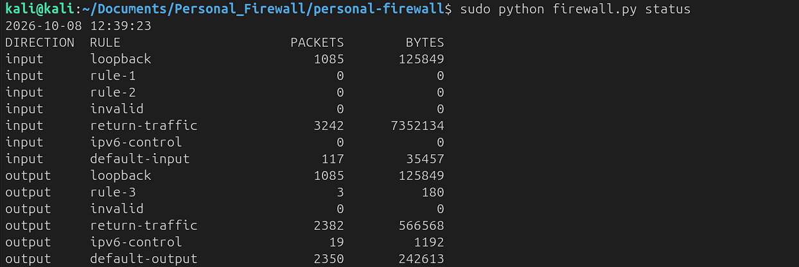
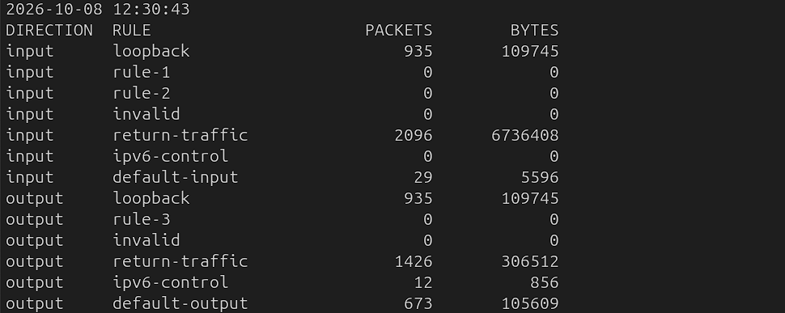
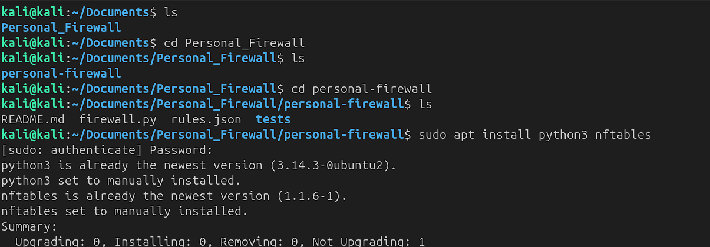
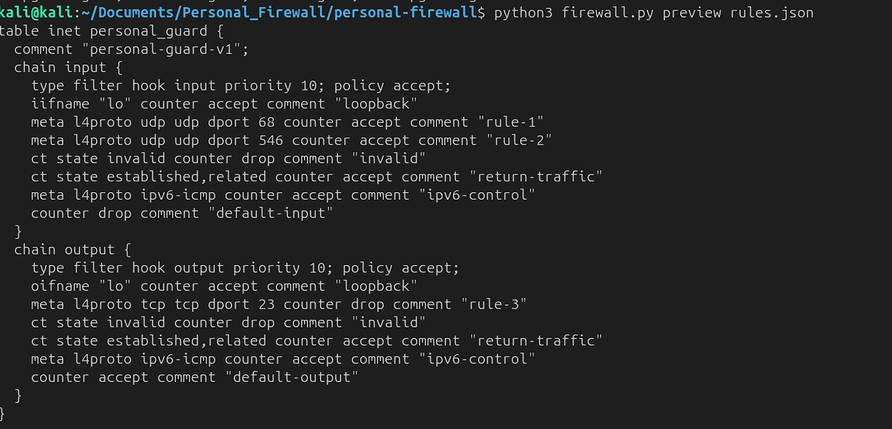
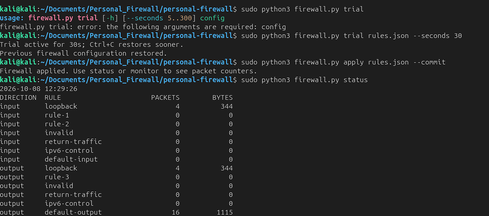
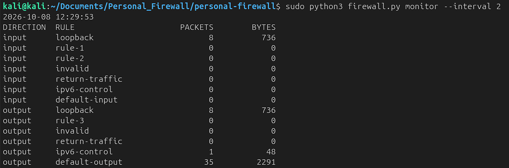
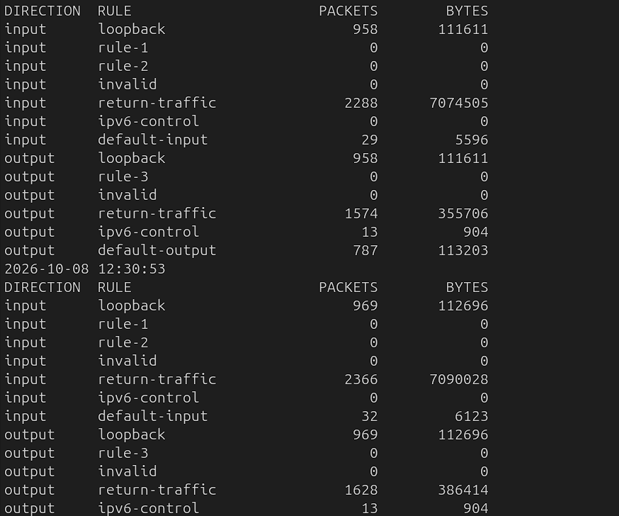
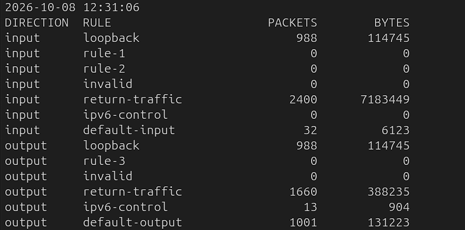
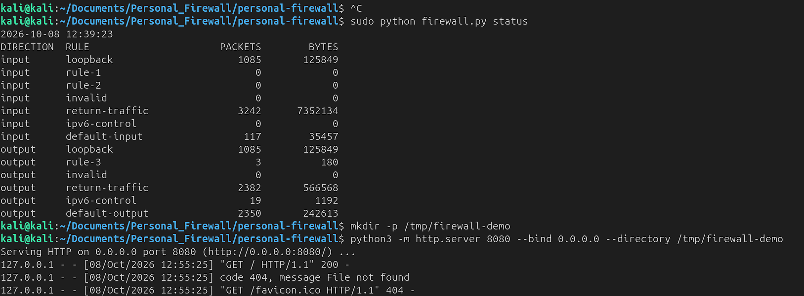

# Personal Guard — Python Personal Firewall

A small, readable personal firewall for a **Linux computer or Linux VM**. Python manages rules; Linux nftables filters real packets. No pip dependencies. Requires Python 3.9+ and nftables with table-comment support (modern Kali/Ubuntu).

## Features

- Filter incoming and outgoing traffic by IP/CIDR, protocol and destination port.
- IPv4 and IPv6 in one dedicated nftables table.
- Live per-rule packet and byte counters.
- Preview by default, kernel validation, atomic rule updates and a timed trial.
- Remove only this application's table; never flush the whole system firewall.
- Strict configuration validation; subprocess calls do not use a shell.

## Project files

| Path | Purpose |
|---|---|
| `firewall.py` | Command-line application and nftables rule generation |
| `rules.json` | Default filtering configuration |
| `tests/test_firewall.py` | Automated unit tests |
| `screenshots/` | Setup, monitoring and test evidence |
| `README.md` | Installation, usage and verification guide |

## Get started

Download or clone this repository. Open a terminal in the folder containing `firewall.py`, then run:

```bash
sudo apt update
sudo apt install python3 nftables
python3 firewall.py preview rules.json
sudo python3 firewall.py check rules.json
sudo python3 firewall.py trial rules.json --seconds 30
```

The trial changes filtering for 30 seconds, then restores the previous Personal Guard configuration. Run from the VM console for the first test: the sample blocks new incoming SSH sessions. Ctrl+C restores early. This is a foreground trial, not a detached watchdog: closing the terminal, SIGTERM, SIGKILL, power loss or a kernel error can prevent restoration. Keep a second local terminal available.

After checking connectivity, install until removal or reboot:

```bash
sudo python3 firewall.py apply rules.json --commit
sudo python3 firewall.py status
sudo python3 firewall.py monitor --interval 2
```

Ctrl+C stops monitoring only; filtering stays active. Disable with:

```bash
sudo python3 firewall.py disable --commit
```

Emergency recovery from a local console if the CLI is unavailable:

```bash
sudo nft delete table inet personal_guard
```

Rules are not automatically saved across reboot. No background service is installed.

## Default behavior

The example drops unmatched incoming packets, permits outgoing packets, and blocks outgoing TCP port 23 (Telnet). Loopback is always accepted first. Explicit user rules run in list order; first match wins. Next, invalid traffic is dropped, established/related traffic is accepted, IPv6 ICMP is accepted for network control, and finally the direction's default action runs.

The sample permits incoming UDP destination ports 68 and 546 for DHCP replies. These port allowances are intentionally broad; they do not authenticate a DHCP server. IPv6 ICMP includes echo requests. Explicit rules can restrict it but may break IPv6 neighbor discovery or path MTU handling. Return traffic for existing connections remains allowed unless an earlier explicit rule blocks it.

## Write rules

Edit `rules.json`, preview, check, and apply again. Unknown fields are rejected.

| Field | Values / meaning |
|---|---|
| direction | `input` or `output` |
| action | `accept` or `drop` |
| protocol | Optional: `any`, `tcp`, `udp`, `icmp`, `ipv6-icmp` |
| remote | Optional literal IP or CIDR; incoming source / outgoing destination |
| port | Optional integer 1–65535; TCP/UDP destination port |

Allow incoming SSH (add before any matching drop):

```json
{"direction": "input", "action": "accept", "protocol": "tcp", "port": 22}
```

Block outgoing traffic to a documentation-example subnet (replace with your intended IP/subnet):

```json
{"direction": "output", "action": "drop", "remote": "192.0.2.0/24"}
```

Block incoming TCP port 8080:

```json
{"direction": "input", "action": "drop", "protocol": "tcp", "port": 8080}
```

A rule without remote/protocol/port matches all non-loopback traffic in that direction. `port` always means destination port, even on incoming packets. Allowing port 80 outbound does not automatically allow DNS or HTTPS. Hostnames, URLs, process names, and port ranges are not supported.

## Monitoring

`monitor` refreshes cumulative packets and bytes for each rule every two seconds. `rule-1` corresponds to the first object in the JSON list. Counters reset on apply. Traffic counted as accepted here can still be dropped by another firewall chain. This is rule-level monitoring, not a packet sniffer, connection list, application attribution, or payload inspection. It does not store browsing history or packet contents.

## Demonstration and results

The screenshots document a Linux VM demonstration on 8 October 2026. The installation output shows Python **3.14.3** and nftables **1.1.6**. These are the versions shown in this demonstration, not minimum version requirements.

| Check | Evidence and result |
|---|---|
| Dependencies | Python and nftables installed |
| Rule preview | Dedicated `inet personal_guard` table with input/output chains |
| Timed trial | A corrected 30-second trial command reports restoration of the previous configuration |
| Activation | `apply rules.json --commit` reports success |
| Monitoring | Live packet and byte counters increase across snapshots |
| Outgoing TCP port 23 block | `output rule-3` changes from 0 to **3 packets / 180 bytes**, consistent with the reported connection test |
| Default incoming drop | Final status shows **117 packets / 35,457 bytes** on `default-input`; their origin is not identified |
| Separate-VM incoming HTTP test | **Pending evidence**; the HTTP server screenshot shows a request from `127.0.0.1`, which uses the accepted loopback path |

Counter values are cumulative packets and bytes, not counts of attacks or unique connections. A timeout alone cannot establish that a firewall blocked traffic; the matching drop counter provides supporting evidence. IPv6 rules are implemented, but no controlled IPv6 blocking test is demonstrated here.

### Reproduce the outgoing test

With the supplied rules active, first record `output rule-3` using `status`, then run:

```bash
sudo python3 firewall.py status
python3 -c "import socket; socket.create_connection(('192.0.2.1', 23), timeout=3)"
sudo python3 firewall.py status
```

A `TimeoutError` is expected if the attempt is dropped. Compare `output rule-3` before and after. The documentation address is only a test destination; the test checks local rule matching and does not require a running Telnet server. If routing fails before a packet reaches the rule, the counter may not increase.

## Screenshots

### Outgoing blocking result

The final status shows **3 packets / 180 bytes** matching the default outgoing TCP port 23 drop rule.



### Live traffic monitoring

Counters show return traffic, loopback traffic and default-rule matches.



<details>
<summary>View the complete setup and testing gallery</summary>

### Dependencies installed

Python and nftables are already installed.



### Generated rule preview

The preview shows the input and output rules without applying them.



### Trial, activation and initial status

The first trial invocation omitted the configuration argument. The corrected command runs successfully, restores the previous configuration, and is followed by activation.



### Monitoring started

Live monitoring uses a two-second interval.



### Traffic counters increasing

Return traffic and default-rule counters increase as the VM exchanges packets.


### Successive monitoring updates

The snapshots show cumulative counters changing over time.



### Later monitoring snapshot

This snapshot precedes the outgoing test; rule-3 is still zero.



### Outgoing block result

Rule-3 records 3 packets and 180 bytes after the reported TCP port 23 test.


### HTTP test server setup

The server starts on port 8080. The successful request is from localhost (127.0.0.1), so it does not verify incoming blocking from a second VM. The favicon 404 only indicates a missing browser icon.



</details>

## Tests

No packages required:

```bash
python3 -m unittest discover -s tests -v
```

The development run passed all **7 unit tests**. Tests cover invalid/injected configuration, family matching, direction mapping, rule precedence, table ownership, preview behavior, validation failure and trial restoration. These are unit tests with mocked kernel operations; they do not prove packet filtering on your machine.

### Verify actual filtering in an isolated lab

Use two Linux VMs on the same isolated virtual network. Keep console access. The firewall protects only the VM running it, not the Windows host or forwarded traffic.

1. On the protected VM, create an empty test directory with `mkdir -p /tmp/firewall-demo`, then start `python3 -m http.server 8080 --bind 0.0.0.0 --directory /tmp/firewall-demo` in a separate terminal.
2. With Personal Guard disabled, use the second VM to run `curl --max-time 3 http://PROTECTED_VM_IP:8080`. Establish that the connection works before testing.
3. Apply the default configuration. Repeat curl: a new connection should time out. Check that `default-input` increases with `status`.
4. Add an incoming TCP port 8080 accept rule, reapply, and repeat: it should work.
5. For outgoing testing, run the HTTP server on the second VM. From the protected VM, verify curl works. Add an outgoing TCP port 8080 drop rule, reapply, and retry: it should time out and that rule's counter should increase.
6. Remove the test rule or disable Personal Guard. Confirm access returns. Test IPv6 separately if your lab has IPv6 configured.

If the initial baseline fails, first check the virtual network, server, routing and existing firewall. Do not disable other security tools just to make this test pass.

## Scope and limitations

- Linux only; preview and unit tests can run elsewhere. Native Windows filtering needs a separate Windows Firewall/WFP implementation.
- Existing UFW/firewalld/Docker/nftables rules continue to apply. An accept here cannot override a drop elsewhere. Other managers may later replace this table.
- Input/output hooks protect local host traffic, not router/bridge/forwarded container traffic. They do not cover ARP or other non-IP traffic.
- Applying new rules resets counters. Updates are atomic within nftables; cooperating CLI mutations are serialized with a lock. External firewall managers do not honor this lock.
- Administrative operations require root. Review code/configuration before running with sudo. Reserve the table name `personal_guard` for this project.
- This is a learning/portfolio project, not an antivirus, intrusion detection system or a fully managed enterprise firewall.

## Design

`rules.json` → validation → nftables text → kernel check → atomic install.
`status` / `monitor` → nftables JSON → packet/byte counters.

Reference: https://netfilter.org/projects/nftables/manpage.html

## Learning outcomes

- Configure host-level packet filtering using Python and nftables.
- Understand incoming/outgoing rules and connection tracking.
- Validate configuration before changing kernel rules.
- Interpret packet counters and distinguish them from attack detections.
- Document reproducible tests and identify gaps in evidence.

## Possible improvements

These are future ideas, not current features:

- Export counters to CSV or JSON.
- Add a stronger rollback watchdog independent of the terminal.
- Provide optional, explicitly configured boot persistence.
- Add controlled IPv4/IPv6 integration tests in network namespaces.
